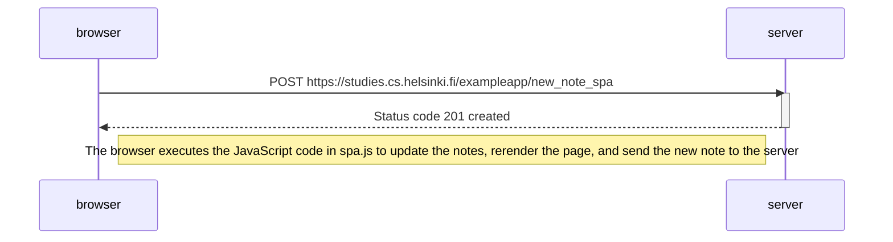

```mermaid
sequenceDiagram
    participant browser
    participant server

    browser->>server: POST https://studies.cs.helsinki.fi/exampleapp/new_note_spa
    activate server
    server-->>browser: Status code 201 created
    deactivate server

    Note right of browser: The browser executes the JavaScript code in spa.js to update the notes, rerender the page, and send the new note to the server
```